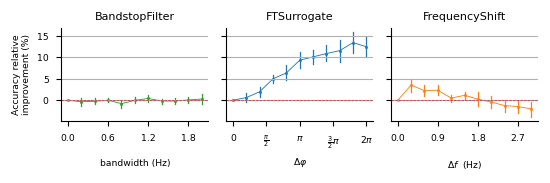
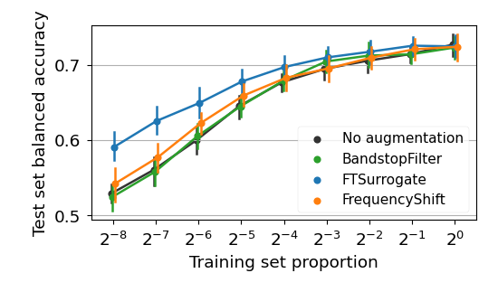
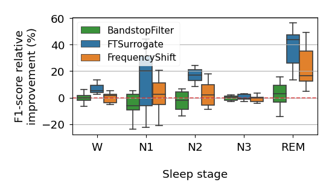

# Data augmentation for EEG

This repository contains the code used in the experiments of _Rommel, Paillard, Moreau and Gramfort, ["Data augmentation for learning predictive models on EEG: a systematic comparison"](https://arxiv.org/abs/2206.14483), 2022_.

 

[](https://codecov.io/gh/eeg-augmentation-benchmark/eeg-augmentation-benchmark-2022)

---

## Getting started

Start by cloning the repository:
```bash
git clone https://github.com/eeg_augmentation_benchmark/eeg_augmentation_benchmark-2022.git
```

### Requirements

Experiments within this repository use the data augmentations implemented in
[Braindecode](https://braindecode.org/) library, which is based on the simple API from [skorch](https://skorch.readthedocs.io/en/stable/) wrapping up the [pytorch](https://pytorch.org/) deep learning framework. The repository also heavily relies on EEG preprocessing tools and datasets available in the [MNE Python](https://mne.tools/stable/index.html)
and [MOABB](http://moabb.neurotechx.com/docs/index.html) libraries.

Other depencies are:
- joblib
- numpy
- pandas
- matplotlib
- seaborn

All of them are listed in `environment.yml` file and can be installed into a new environment using [Anaconda](https://www.anaconda.com/products/distribution) by running:
```bash
conda env create -f environment.yml
```
from the package root directory.

### Other prerequisites

After installing the necessary requirements, you should install the package
itself. For this, go to the root directory of the package and run
```bash
pip install -e .
```

## Running paper experiments

### Parameter searches

Parameter searches presented on figures 4, 9, 13 and 14 can be run with:
```bash
bash param_search/run.sh $DEVICE
bash param_search/run_bci.sh $DEVICE
```
where `$DEVICE` corresponds to `cpu` or any cuda device that should be used for training.

Once these scripts are done executing, you can plot the corresponding figures with
```bash
bash param_search/plot_all.sh
```
They will be saved in `outputs/physionet/figures/` and `outputs/BCI/figures/`.



### Learning curves and boxplots

Likewise, to plot the learning curves from figures 5, 10, 15, 16 and 19, as well as the boxplots 6, 11, 12, 17 and 18, one can run:
```bash
bash learning_curves/run.sh $DEVICE
bash learning_curves/run_bci.sh $DEVICE
bash learning_curves/plot_all.sh
```





## Citation

If you use the code in this repository, please consider citing:
```
@article{rommel-et-al-2022,
  title={Data augmentation for learning predictive models on {EEG}: a systematic comparison},
  author={Rommel, Cédric and Paillard, Joseph and Moreau, Thomas and Gramfort, Alexandre},
  year={2022},
  journal={arXiv},
}
```
